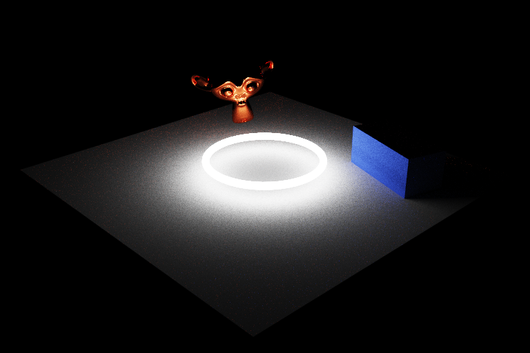

# Raytracer

Raytracer for simply-format scenes. Generates pictures in `.ppm` format. See [samples](samples) of scenes descriptions (`.txt` files) and corresponding results of raytracing.

### Build and run project

Run `build.sh` and after `run.sh in_scene image` where `in_scene` is path to scene description and `out_scene` is path to your `.ppm` out image.

### Samples of scenes

